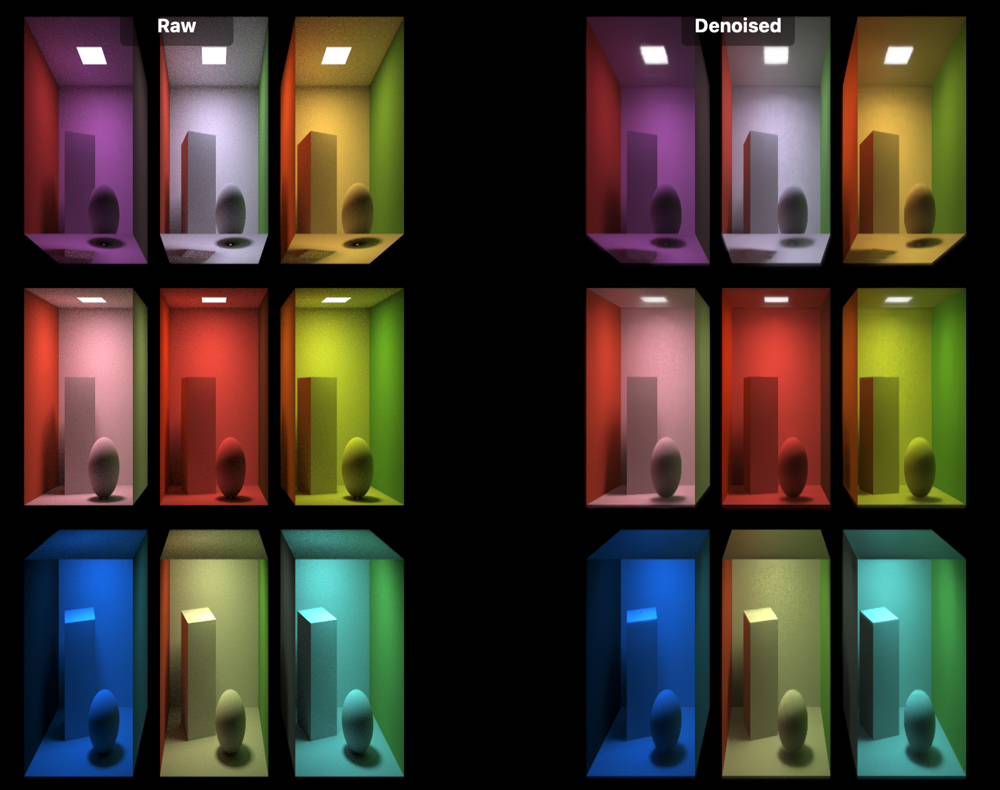

# MTLFXTemporalDenoisedScaler Validation App

This repository is a derivative of Apple's Metal ray tracing sample, repurposed as a small app for validating and comparing `MTLFXTemporalDenoisedScaler`.

It is useful when you want to:

- inspect raw ray-traced output versus denoised output
- compare both images side by side in the same scene
- toggle MetalFX optional inputs such as jitter, depth, motion, motion scale, world-to-view, and view-to-clip
- adjust manual exposure and switch between auto/manual exposure behavior
- inspect supporting buffers such as depth, motion, roughness, normal, diffuse, and specular views

## Current App Behavior

The app renders a ray-traced Cornell box scene and exposes a control drawer on the left side.

From the UI you can switch between:

- `Raw`
- `Denoised`
- `Side by Side`

The `Side by Side` mode shows the non-denoised result on the left and the denoised result on the right, which makes it easier to verify MetalFX behavior without repeatedly toggling modes.

## Purpose

This project is not trying to be a generic renderer or a polished product UI. Its main goal is to provide a practical testbed for checking:

- whether `MTLFXTemporalDenoisedScaler` is available on the current device
- how output changes when individual scaler inputs are enabled or disabled
- how stable the denoised result is across motion, jitter, and exposure settings
- whether G-buffer inputs and camera matrices are wired correctly

## Base Sample and License

This repository is based on Apple's sample code and contains additional modifications for MetalFX experimentation.

- The Apple sample code license included in [LICENSE.txt](LICENSE.txt) must remain in redistributed copies or substantial portions of this code.
- This repository is an independent derivative work and is not affiliated with, endorsed by, or supported by Apple.
- Review the included license yourself before public redistribution if you need a legal determination for your specific use.

Relevant Apple sessions:

- [WWDC22 Session 10105: Maximize your Metal ray tracing performance](https://developer.apple.com/wwdc22/10105/)
- [WWDC20 Session 10012: Discover ray tracing with Metal](https://developer.apple.com/wwdc20/10012/)

## Requirements

- macOS 11 or later, or iOS 14 or later
- Xcode 12 or later
- a device that supports Metal ray tracing
- `MTLFXTemporalDenoisedScaler` validation requires a platform/device that supports MetalFX temporal denoising
